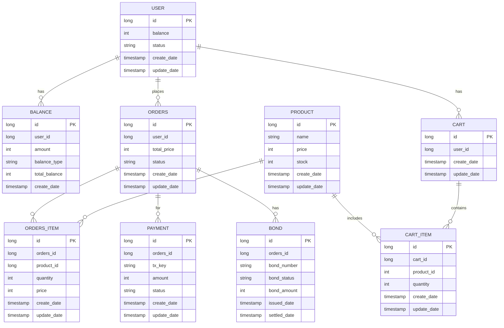

# ERD

---
# 테이블 명세서

### USER 테이블
- 유저 정보 테이블  

| **필드명**       | **타입**         | **설명**                    |
|------------------|------------------|---------------------------|
| `id`             | long PK          | 유저 고유 Id                  |
| `status`         | string          | 유저 상태 |
| `create_date`    | timestamp        | 유저 생성 날짜                  |
| `update_date`    | timestamp        | 유저 상태 업데이트 날짜             |

### BALANCE 테이블
- 유저 잔액 관리 테이블  

| **필드명**         | **타입**           | **설명**        |
|-----------------|------------------|---------------|
| `id`            | long PK          | 잔액 거래 고유 Id   |
| `user_id`       | long             | 유저 고유 식별자     |
| `amount`        | int              | 요청 금액         |
| `balance_type`  | string           | 요청 유형 (충전, 차감) |
| `total_balance` | int              | 현재 잔액         |
| `create_date`   | timestamp        | 요청이 발생한 날짜    |

### PRODUCT 테이블
- 상품 테이블  

| **필드명**         | **타입**         | **설명**     |
|-----------------|------------------|------------|
| `id`            | long PK          | 상품 고유 Id   |
| `name`  | string           | 상품 이름      |
| `price` | int              | 상품 가격      |
| `stock` | int              | 상품 재고 수량   |
| `create_date`   | timestamp        | 상품 등록 날짜   |
| `update_date`    | timestamp        | 상품 업데이트 날짜 |

### ORDERS 테이블
- 주문 테이블  

| **필드명**       | **타입**         | **설명**                                |
|---------------|------------------|---------------------------------------|
| `id`          | long PK          | 주문 고유 Id                              |
| `user_id`     | long             | 유저 고유 Id                              |
| `total_price` | int              | 총 주문 금액                               |
| `status`      | string           | 주문 상태 (`pending`, `paid`, `cancelled`) |
| `create_date` | timestamp        | 주문 생성 날짜                              |
| `update_date` | timestamp        | 주문 업데이트 날짜                            |

### ORDERS_ITEM 테이블
- 개별 상품 테이블  

| **필드명**       | **타입**         | **설명**        |
|---------------|------------------|---------------|
| `id`          | long PK          | 주문 상품 고유 Id   |
| `orders_id`    | long             | 주문 고유 Id      |
| `product_id`  | long             | 상품 고유 Id      |
| `quantity`    | int              | 상품 수량         |
| `price`       | int              | 개별 상품 가격      |
| `create_date` | timestamp        | 주문 상품 생성 날짜   |
| `update_date` | timestamp        | 주문 상품 업데이트 날짜 |

### BOND 테이블
- 채권 테이블

| **필드명**      | **타입**         | **설명**                                 |
|-----------------|------------------|----------------------------------------|
| `id`            | long PK          | 채권 고유 Id                               |
| `orders_id`      | long             | 주문 고유 Id                               |
| `bond_number`   | string           | 고유 채권 번호                               |
| `bond_status`   | string           | 채권 상태 (`issued`, `settled`, `expired`) |
| `bond_amount`   | int              | 채권 금액 (미결제 금액)                         |
| `issued_date`   | timestamp        | 채권 발행 날짜                               |
| `settled_date`  | timestamp        | 채권 정산 날짜                               |

### PAYMENT 테이블
- 결제 테이블  

| **필드명**       | **타입**     | **설명**                      |
|---------------|------------|-----------------------------|
| `id`          | long PK    | 결제 고유 Id                    | 
| `orders_id`    | long       | 주문 고유 Id                    |
| `tx_key`      | string     | 결제 트랜잭션 Key                 |
| `amount`      | int        | 결제 금액                       |
| `status`      | string     | 결제 상태 (`success`, `failed`) |
| `create_date` | timestamp  | 결제 생성 날짜                    |
| `update_date` | timestamp  | 결제 완료 날짜                    |

### CART 테이블
- 장바구니 테이블  

| **필드명**      | **타입**         | **설명**     |
|-----------------|------------------|------------|
| `id`            | long PK          | 장바구니 고유 Id |
| `user_id`       | long             | 유저 고유 Id   |
| `create_date`   | timestamp        | 장바구니 생성 날짜 |
| `update_date`   | timestamp        | 장바구니 수정 날짜 |

### CART_ITEM 테이블
- 장바구니에 있는 개별 상품 테이블  

| **필드명**      | **타입**         | **설명**        |
|-----------------|------------------|---------------|
| `id`            | long PK          | 장바구니 상품 고유 Id |
| `cart_id`       | long             | 장바구니 고유 Id    |
| `product_id`    | long             | 상품 고유 Id      |
| `quantity`      | int              | 상품 수량         |
| `create_date`   | timestamp        | 장바구니 상품 생성 날짜 |
| `update_date`   | timestamp        | 장바구니 상품 수정 날짜 |
