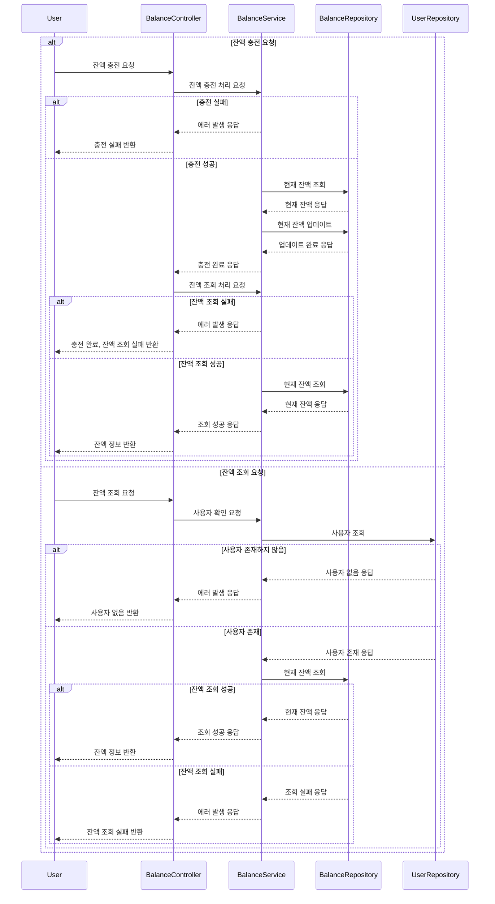
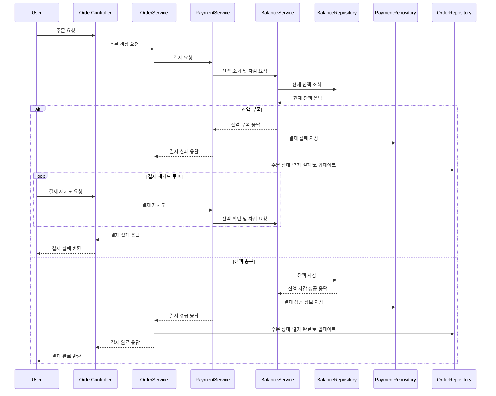
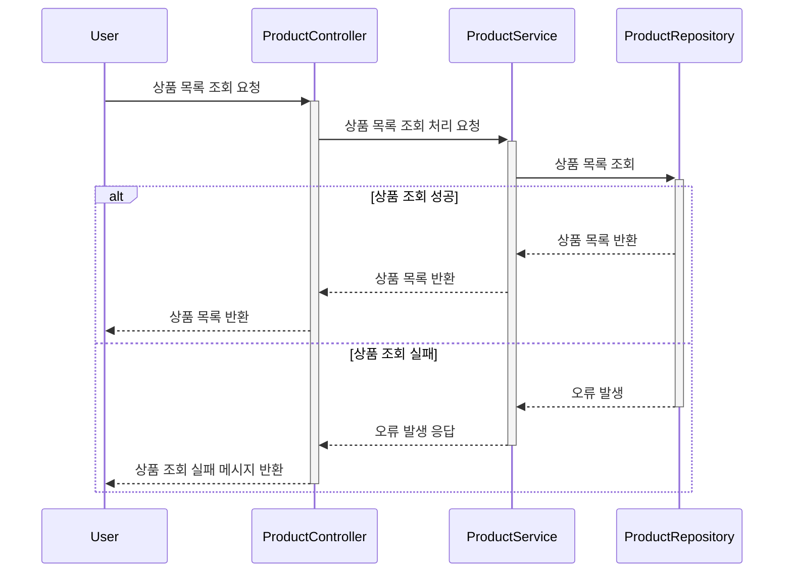
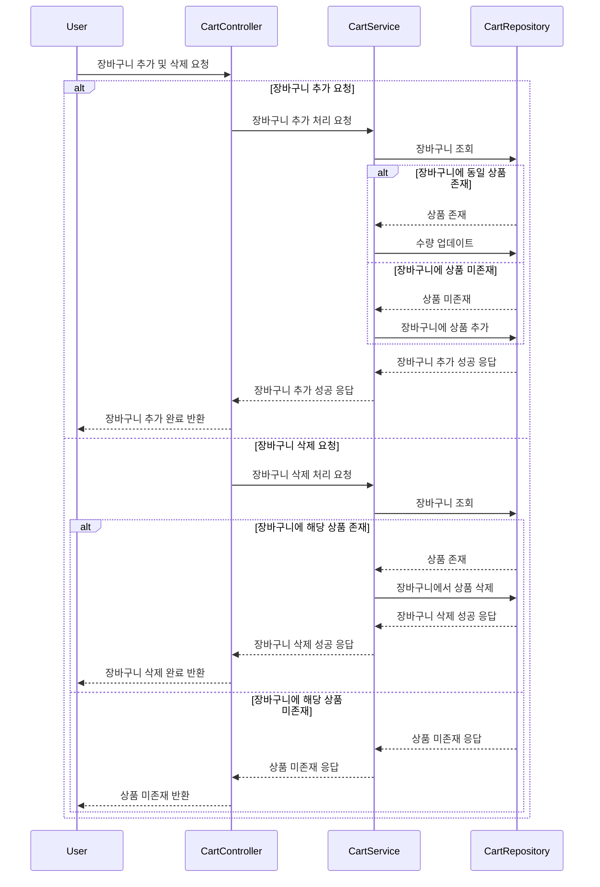

# 시퀀스 다이어그램

### 1. 잔액 충전/조회 시퀀스 다이어그램

```mermaid
sequenceDiagram
    participant User
    participant BalanceController
    participant BalanceService
    participant BalanceRepository
    participant UserRepository

    alt 잔액 충전 요청
        User->>BalanceController: 잔액 충전 요청
        BalanceController ->> BalanceService : 잔액 충전 처리 요청
        alt 충전 실패
            BalanceService -->> BalanceController : 에러 발생 응답
            BalanceController -->> User : 충전 실패 반환
        else 충전 성공
            BalanceService ->> BalanceRepository : 현재 잔액 조회
            BalanceRepository -->> BalanceService : 현재 잔액 응답
            BalanceService ->> BalanceRepository : 현재 잔액 업데이트
            BalanceRepository -->> BalanceService : 업데이트 완료 응답
            BalanceService -->> BalanceController : 충전 완료 응답
            BalanceController ->> BalanceService : 잔액 조회 처리 요청
            alt 잔액 조회 실패
                BalanceService -->> BalanceController : 에러 발생 응답
                BalanceController -->> User : 충전 완료, 잔액 조회 실패 반환
            else 잔액 조회 성공
                BalanceService ->> BalanceRepository : 현재 잔액 조회
                BalanceRepository -->> BalanceService : 현재 잔액 응답
                BalanceService -->> BalanceController : 조회 성공 응답
                BalanceController -->> User : 잔액 정보 반환
            end
        end
    else 잔액 조회 요청
        User ->> BalanceController : 잔액 조회 요청
        BalanceController ->> BalanceService : 사용자 확인 요청
        BalanceService ->> UserRepository : 사용자 조회
        alt 사용자 존재하지 않음
            UserRepository -->> BalanceService : 사용자 없음 응답
            BalanceService -->> BalanceController : 에러 발생 응답
            BalanceController -->> User : 사용자 없음 반환
        else 사용자 존재
            UserRepository -->> BalanceService : 사용자 존재 응답
            BalanceService ->> BalanceRepository : 현재 잔액 조회
            alt 잔액 조회 성공
                BalanceRepository -->> BalanceService : 현재 잔액 응답
                BalanceService -->> BalanceController : 조회 성공 응답
                BalanceController -->> User : 잔액 정보 반환
            else 잔액 조회 실패
                BalanceRepository -->> BalanceService : 조회 실패 응답
                BalanceService -->> BalanceController : 에러 발생 응답
                BalanceController -->> User : 잔액 조회 실패 반환
            end
        end
    end
```

### 2. 주문 결제 시퀀스 다이어그램

```mermaid
sequenceDiagram
    participant User
    participant OrderController
    participant OrderService
    participant PaymentService
    participant BalanceService
    participant BalanceRepository
    participant PaymentRepository
    participant OrderRepository

    User ->> OrderController : 주문 요청
    OrderController ->> OrderService : 주문 생성 요청
    OrderService ->> PaymentService : 결제 요청
    PaymentService ->> BalanceService : 잔액 조회 및 차감 요청
    BalanceService ->> BalanceRepository : 현재 잔액 조회
    BalanceRepository -->> BalanceService : 현재 잔액 응답
    alt 잔액 부족
        BalanceService -->> PaymentService : 잔액 부족 응답
        PaymentService ->> PaymentRepository : 결제 실패 저장
        PaymentService -->> OrderService : 결제 실패 응답
        OrderService ->> OrderRepository : 주문 상태 '결제 실패'로 업데이트
        loop 결제 재시도 루프
            User ->> OrderController : 결제 재시도 요청
            OrderController ->> PaymentService : 결제 재시도
            PaymentService ->> BalanceService : 잔액 확인 및 차감 요청
        end
        OrderService -->>OrderController : 결제 실패 응답
        OrderController -->> User : 결제 실패 반환
    else 잔액 충분
        BalanceService ->> BalanceRepository : 잔액 차감
        BalanceRepository -->> BalanceService : 잔액 차감 성공 응답
        PaymentService ->> PaymentRepository : 결제 성공 정보 저장
        PaymentService -->> OrderService : 결제 성공 응답
        OrderService ->> OrderRepository : 주문 상태 '결제 완료'로 업데이트
        OrderService -->> OrderController : 결제 완료 응답
        OrderController -->> User : 결제 완료 반환
    end
```

### 3. 상품 조회 시퀀스 다이어그램

```mermaid
sequenceDiagram
    participant User
    participant ProductController
    participant ProductService
    participant ProductRepository

    User ->>+ ProductController : 상품 목록 조회 요청
    ProductController ->>+ ProductService : 상품 목록 조회 처리 요청
    ProductService ->>+ ProductRepository : 상품 목록 조회
    alt 상품 조회 성공
        ProductRepository -->> ProductService : 상품 목록 반환
        ProductService -->> ProductController : 상품 목록 반환
        ProductController -->> User : 상품 목록 반환
    else 상품 조회 실패
        ProductRepository -->>- ProductService : 오류 발생
        ProductService -->>- ProductController : 오류 발생 응답
        ProductController -->>- User : 상품 조회 실패 메시지 반환
    end
```

### 4. 장바구니 추가/삭제 시퀀스 다이어그램

```mermaid
sequenceDiagram
    participant User
    participant CartController
    participant CartService
    participant CartRepository

    User ->> CartController : 장바구니 추가 및 삭제 요청
    alt 장바구니 추가 요청
        CartController ->> CartService : 장바구니 추가 처리 요청
        CartService ->> CartRepository : 장바구니 조회
        alt 장바구니에 동일 상품 존재
            CartRepository -->> CartService : 상품 존재
            CartService ->> CartRepository : 수량 업데이트
        else 장바구니에 상품 미존재
            CartRepository -->> CartService : 상품 미존재
            CartService ->> CartRepository : 장바구니에 상품 추가
        end
        CartRepository -->> CartService : 장바구니 추가 성공 응답
        CartService -->> CartController : 장바구니 추가 성공 응답
        CartController -->> User : 장바구니 추가 완료 반환
    else 장바구니 삭제 요청
        CartController ->> CartService : 장바구니 삭제 처리 요청
        CartService ->> CartRepository : 장바구니 조회
        alt 장바구니에 해당 상품 존재
            CartRepository -->> CartService : 상품 존재
            CartService ->> CartRepository : 장바구니에서 상품 삭제
            CartRepository -->> CartService : 장바구니 삭제 성공 응답
            CartService -->> CartController : 장바구니 삭제 성공 응답
            CartController -->> User : 장바구니 삭제 완료 반환
        else 장바구니에 해당 상품 미존재
            CartRepository -->> CartService : 상품 미존재 응답
            CartService -->> CartController : 상품 미존재 응답
            CartController -->> User : 상품 미존재 반환
        end
    end
```