# Swagger API 구현

## Swagger API
- 문서는 아래에서 확인할 수 있습니다.
- http://localhost:8080/swagger-ui/swagger-ui/index.html

## 구현 캡쳐본
### 주문/결제 API
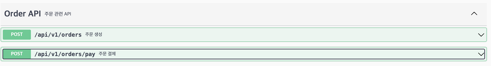

- 주문 요청 API
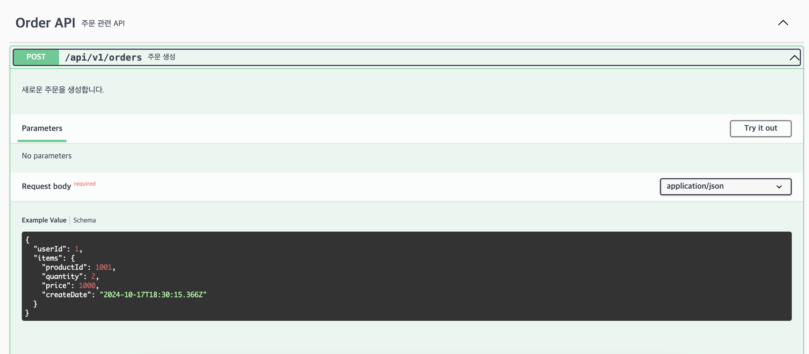

- 주문 응답 API
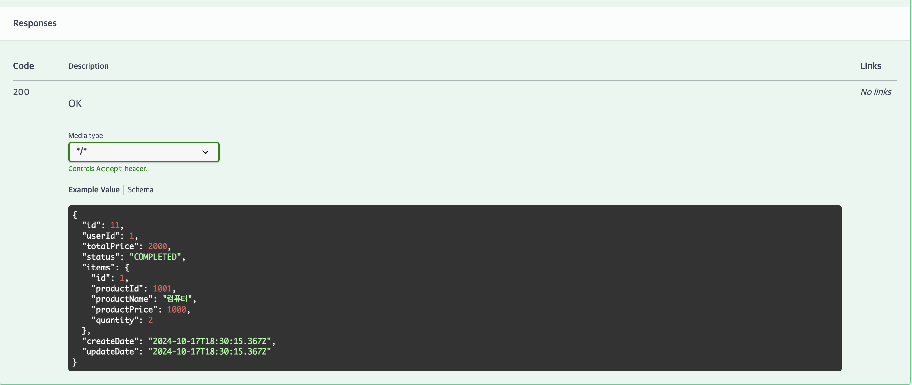

- 결제 요청 API
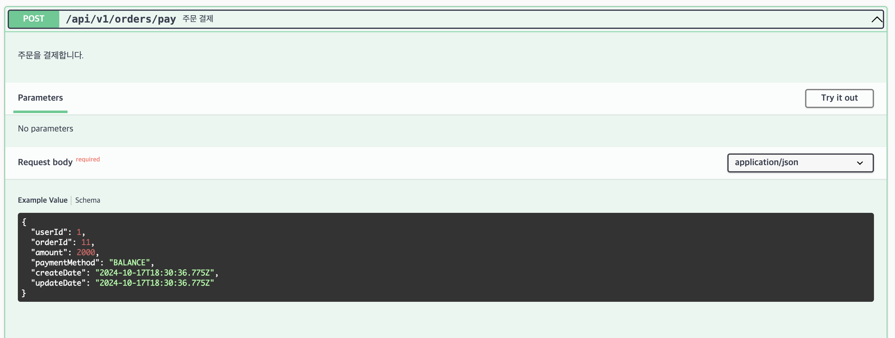
 
- 결제 응답 API
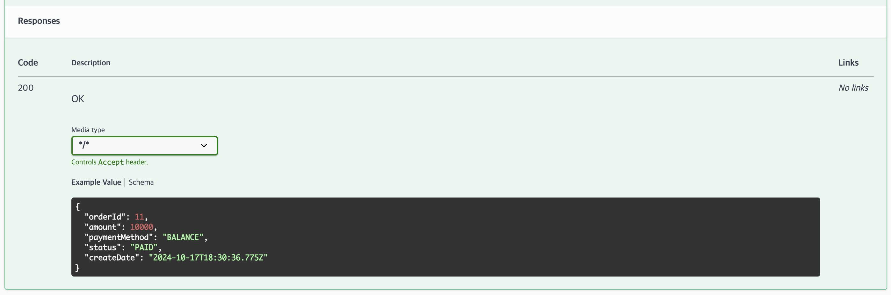

### 상품 조회 API
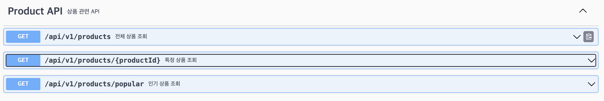

- 전체 상품 조회 요청 API
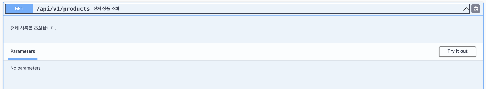

- 전체 상품 조회 응답 API
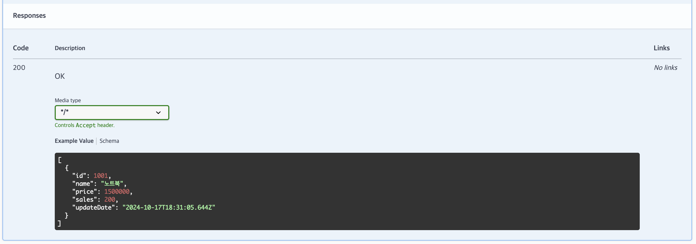

- 특정 상품 조회 요청 API
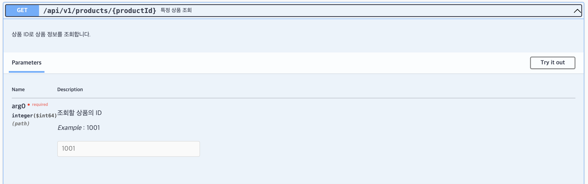

- 특정 상품 조회 응답 API
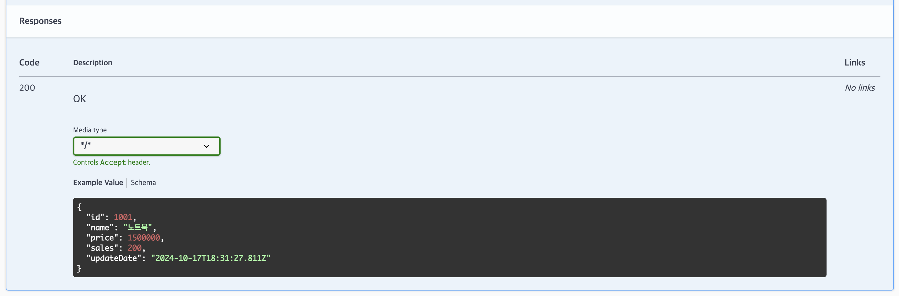

- 인기 상품 조회 요청 API
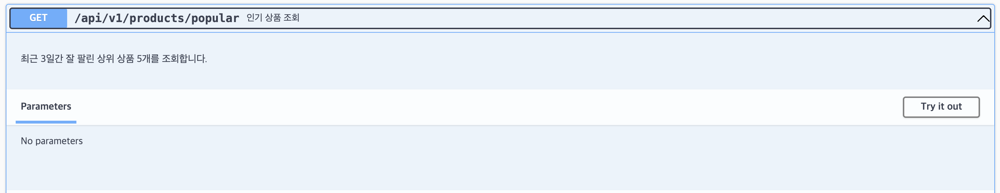

- 인기 상품 조회 응답 API
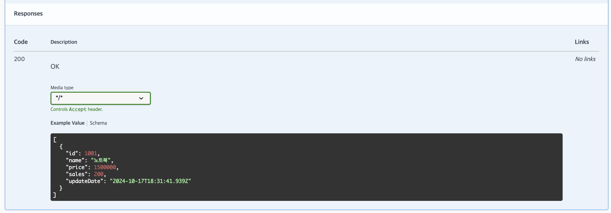