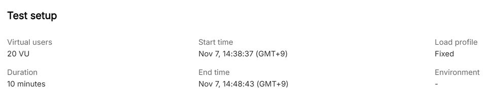
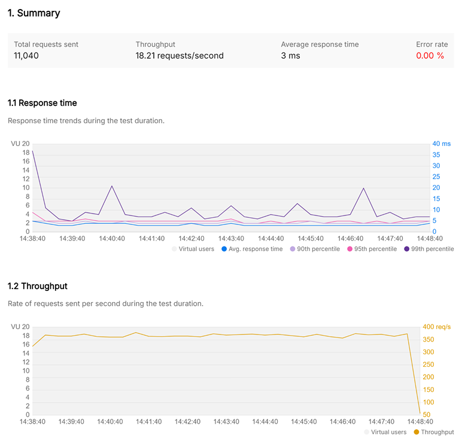
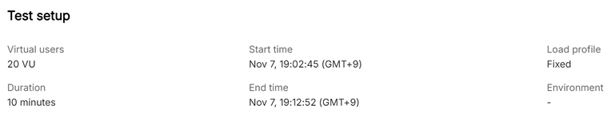
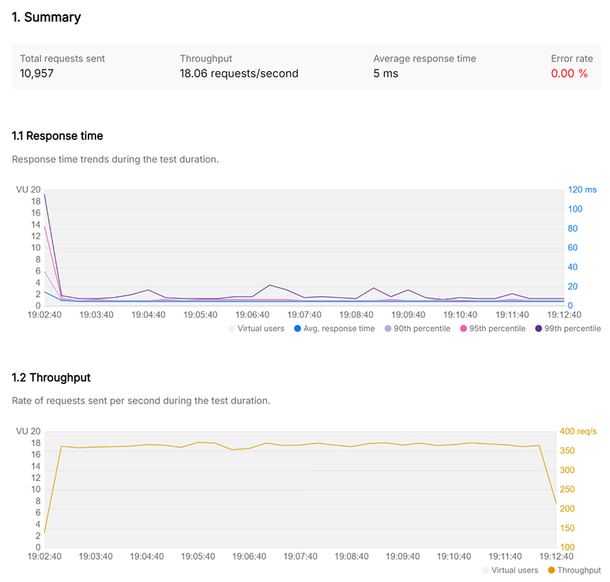
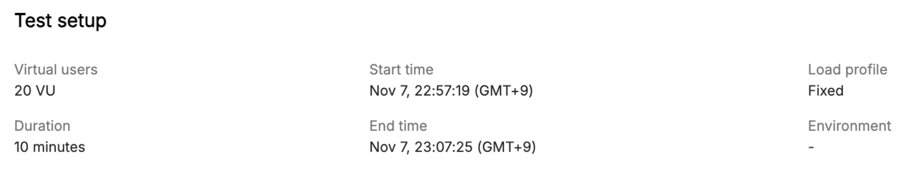
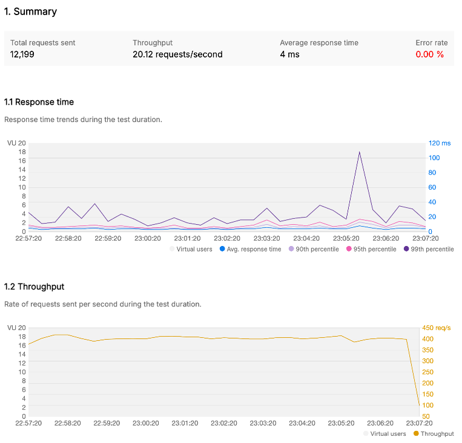
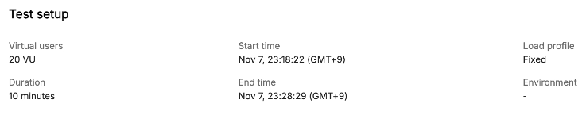
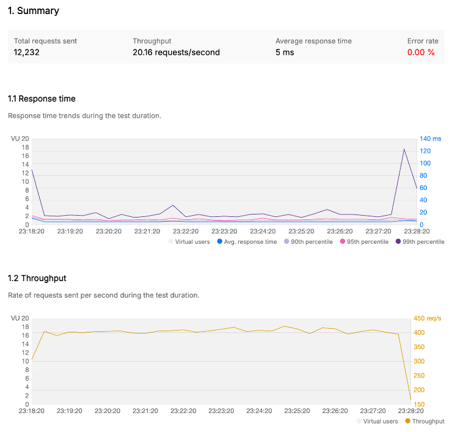

# Redis 캐시 적용에 따른 성능 개선 분석 보고서

---

# 1. 전체 상품 조회 API

## 1. 테스트 개요

- 목적 : 전체 상품 조회 API 성능을 개선하기 위해 캐싱 적용 전후의 성능 비교 분석
- 대상 API : `GET /api/v1/products`
- 테스트 환경 :
    - 애플리케이션 서버 :
        - Java 버전 : Amazon Corretto 17.0.13
        - 프레임워크 : Spring Boot 3.3.4
    - Redis 서버 :
        - 운영 체제 :  Linux 5.15.153.1-microsoft-standard-WSL2 x86_64
        - Redis 버전 : 7.4.1
        - 클라이언트 연결 수 제한: 10000
    - 테스트 도구 : Postman

## 2. 기본 코드 테스트

- 테스트 설정
    - **가상 사용자** : 20명
    - **테스트 기간** : 10분
- 결과
    - **요청 수** : 11, 040
    - **평균 응답 시간** : 3 ms
    - **최소 응답 시간** : 2 ms
    - **최대 응답 시간** : 45 ms
    - **Throughput**: 18.21 req/sec
    - **에러 발생률**: 0%

## 3. 캐싱 적용 후 테스트

- **테스트 설정**
    - **가상 사용자** : 20명
    - **Redis TTL 설정**: 5분
    - **테스트 기간**: 10분
- **결과 요약**
    - **요청 수** : 10,957
    - **평균 응답 시간**: 5 ms
    - **최소 응답 시간** : 3 ms
    - **최대 응답 시간**: 127 ms
    - **Throughput**: 18.06 req/sec
    - **에러 발생률**: 0%

## 4. 분석 및 결론

- 캐싱 적용 효과
    - 응답 시간 개선 : 평균 응답 시간이 3ms에서 5ms로 약 66.67% 증가 → 성능 저하
    - Throughput 개선 : 초당 처리량이 18.21 req/sec에서 18.06 req/sec로 약 0.82% 감소 → 초당 처리량이 낮아짐
    - 요청 수 감소 : 요청 수가  11, 040건에서 10,957건으로 약 0.75% 감소
- 결론
    - Redis 캐시를 사용하였음에도 성능이 개선되지 않았다. 이게 무슨일이야!!🤯😭

---

# 2. 인기 상품 조회 API

## 1. 테스트 개요

- 목적 : 최근 3일 동안 잘 팔린 상품 상위 5개 조회 API 성능을 개선하기 위해 캐싱 적용 전후의 성능 비교 분석
- 대상 API : `GET /api/v1/products/popular`
- 테스트 환경 :
    - 애플리케이션 서버 :
        - Java 버전 : Amazon Corretto 17.0.13
        - 프레임워크 : Spring Boot 3.3.4
    - Redis 서버 :
        - 운영 체제 :  Linux 5.15.153.1-microsoft-standard-WSL2 x86_64
        - Redis 버전 : 7.4.1
        - 클라이언트 연결 수 제한: 10000
    - 테스트 도구 : Postman

## 2. 기본 코드 테스트

- 테스트 설정
    - **가상 사용자** : 20명
    - **테스트 기간** : 10분
- 결과
    - **요청 수** : 12,199
    - **평균 응답 시간** : 4 ms
    - **최소 응답 시간** : 1 ms
    - **최대 응답 시간** : 285 ms
    - **Throughput**: 20.12 req/sec
    - **에러 발생률**: 0%

## 3. 캐싱 적용 후 테스트

- **테스트 설정**
    - **가상 사용자** : 20명
    - **`Redis TTL 설정**: 5분
    - **테스트 기간**: 10분
- **결과 요약**
    - **요청 수** : 12,232
    - **평균 응답 시간**: 5 ms
    - **최소 응답 시간** : 2 ms
    - **최대 응답 시간**: 385 ms
    - **Throughput**: 20.13 req/sec
    - **에러 발생률**: 0%

## 4. 분석 및 결론

- 캐싱 적용 효과
    - 응답 시간 개선 : 평균 응답 시간이 4ms에서 5ms로 약 25% 증가 → 성능 저하
    - Throughput 개선 : 초당 처리량이 20.12 req/sec에서 20.13 req/sec로 약 0.05% 증가 → 초당 처리량이 많아짐
    - 요청 수 감소 : 요청 수가  12,199건에서 12,232건으로 약 0.27% 감소
- 결론
    - Redis 캐시를 사용하였음에도 성능이 개선되지 않았다. 미치겠네,,,😇😱

---
# 성능 개선 실패 원인 분석
## 1. 캐싱 데이터가 적절하지 않음
### 1. 문제 자가진단 : 
- 캐시된 데이터를 자주 갱신되지 않고 새로운 데이터 요청이 많은 경우? 즉 캐시의 히트율이 낮아져서 캐시 조회 하느라 관리 비용이 추가돼 성능이 저하된건가? 그건 아닌것 같은데 이유를 모르겠다..
### 2. 해결 방안 : 
- 만약 캐싱 데이터가 자주 갱신 된다면 데이터들을 분류해서 캐싱에 적합한 데이터만 캐싱 전략을 사용하도록 해야한다.
### 3. 기대 효과 : 
- 캐시 과부하가 줄어들어 응답 시간이 감소되고 처리량이 증가할 것이다.

## 2. 캐시 갱신 문제
### 1. 문제 자가진단 :
- 캐시 만료 주기가 너무 짧아 캐시 갱신이 자주 발생할 경우 -> 5분인데!!! 5분이 짧아?!
- 갱신 주기가 짧으면 캐시 생성 및 소모되는 자원 소모량이 증가해서 성능이 저하될 수 있다.
### 2. 해결 방안 :
- 자주 갱신 될 필요가 없는 데이터는 캐시 주기를 길게 설정해 갱신 비용을 줄일 수 있다.
### 3. 기대 효과 : 
- 효율적인 자원 사용이 가능해진다.

## 3. 캐시 저장소의 과부하
### 1. 문제 자가진단 : 
- Redis 같이 외부 캐시 저장소의 자원이 부족하거나 과부하 -> 설마,,,? 처음 조회하는건데,,,
### 2. 해결 방안 : 
- 부분적으로 캐싱을 적용해 캐싱이 필요한 부분만 호출하도록 한다.
### 3. 기대 효과 : 
- 캐시 과부하가 줄어들어 초당 처리량이 증가 할 수 있다.

---

제가 무엇을 잘못 하고 있는걸까요....?😭